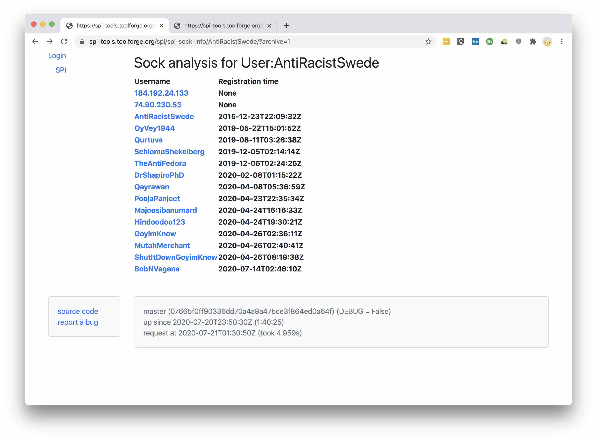

# SPI Tools

This is a collection of utilities to help process wikipedia
sock-puppet investigations, specifically [on
enwiki](https://en.wikipedia.org/wiki/Wikipedia:Sockpuppet_investigations).
This is very much a work in progress; expect things to break, to be
missing, to be confusing, etc.  Please file bug reports.

## Quick Start

Start by navigating to the SPI Tools home page,
https://spi-tools.toolforge.org/.  The big drop-down menu lists all
the currently active SPIs.  This is obtained by parsing WP:Sockpuppet
investigations/Cases/Overview on the fly.  Pick the SPI you're
interested in, and click one of the three buttons.

By default, both the current SPI page and the archive (if it exists)
are pulled in.  If the archive is large, that can be slow, so you can
uncheck "Use archive?" if you want.

### IP Info

This shows you all the IPs that have been mentioned in {{checkip}}
templates.  There's also a (rather clumsy) way to select a subset of
them and see what CIDR range would cover them.

### Sock Info

This gives you information about individual socks.  For our purposes,
a sock is any user mentioned in a {{SPIarchive notice}},
{{checkuser}}, or {{user}} template.

## Authentication

Some functions (such as listing deleted contributions) require admin
rights.  You can either login using the "Login" link at the top o the
navbar, or wait to be prompted to login when you access some function
which requires admin rights.

The tool uses [OAUTH](https://www.mediawiki.org/wiki/Help:OAuth) to
authenticate using your mediawiki credentials.  The tool only reads
data using the [mediawiki
API](https://www.mediawiki.org/wiki/API:Main_page); no edits or admin
actions (other than reading admin-restricted data) are ever performed.
The tool depends on your access permissions as conveyed via OAUTH;
logging into the tool as a non-admin won't give you admin access to
anything.
